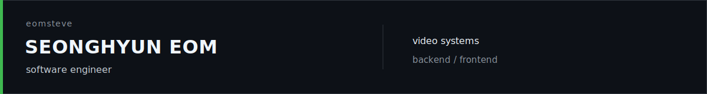

  

  Software engineer working across real-time video, backend services, and product interfaces.

### stack

`frontend`

`backend`

`systems`

DeepStream · GStreamer · RTSP · WebRTC

### contribution garden

  <picture>
    <source media="(prefers-color-scheme: dark)" srcset="https://raw.githubusercontent.com/eomsteve/eomsteve/output/github-contribution-grid-snake-dark.svg" />
    <source media="(prefers-color-scheme: light)" srcset="https://raw.githubusercontent.com/eomsteve/eomsteve/output/github-contribution-grid-snake.svg" />
    
  </picture>

  <a href="mailto:mingyov0807@gmail.com">mingyov0807@gmail.com</a>

